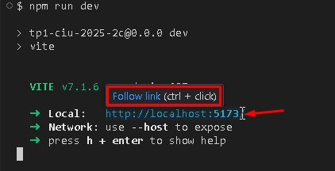

# FrontEnd Cafeteria Luna & Granos Café

## Universidad Nacional de Hurlingham
## Trabajo Practico Nº 1 - Construccion de Interfaces de Usuario
### Segundo Cuatrimestre - Año 2025

### Docentes
- Lucas Adriel Figarola
- Ailen Pisoni

### Grupo 13
#### Integrantes:

- Ezequiel Andrés Muñoz
- Facundo Roberto Arias
- Asam Fernando
- Meza Tomás Luciano
- Javier Asato Finen

## Descripcion del Proyecto

FrontEnd de la Cafeteria Luna & Granos Café es una pagina web hecha en React, que permite a un usuario del sitio
visitar diferentes secciones con informacion y servicios brindados por el negocio, desde una breve introduccion a la
historia y valores que lo conforman, hasta una carta que permite seleccionar diferentes platos que cuentan con imagenes
y descripciones detalladas de cada uno. Cuenta ademas con una seccion Carrito donde se pueden visualizar los productos seleccionados 
hasta el momento y otra para dejar datos y/o consultas o sugerencias y realizar una reserva.
La aplicacion es una SPA (Single Page Application) caracteristica que brinda una experiencia de usuario mas fluida y cuenta
con diseño responsivo y estilo visual consistente implementados en css. 

## Caracteristicas

### Paginas

**Inicio**:

-Captura

-Descripcion

**Carta**:

-Captura

-Descripcion

**Carrito**:

-Captura

-Descripcion

**Contacto y Reserva**:

-Captura

-Descripcion

**NavBar**:

-Captura

-Descripcion

### Features
- Modo Oscuro
- Buscador por nombre de producto en tiempo real


## Tecnologias

**Cliente:** React, Bootsrap, Vite

**Servidor:** Node

## 📦 Dependencias

#### ⚙️ Dependencias de produccion que utiliza el proyecto

```json
  "dependencies": {
    "bootstrap": "^5.3.8",
    "formik": "^2.4.6",
    "react": "^19.1.1",
    "react-bootstrap": "^2.10.10",
    "react-dom": "^19.1.1",
    "react-router-dom": "^7.9.1",
    "yup": "^1.7.1"
  }
```
#### 🧰 Dependencias de desarrollo que utiliza el proyecto

```json
  "devDependencies": {
    "@eslint/js": "^9.35.0",
    "@types/react": "^19.1.13",
    "@types/react-dom": "^19.1.9",
    "@vitejs/plugin-react": "^5.0.2",
    "eslint": "^9.35.0",
    "eslint-plugin-react-hooks": "^5.2.0",
    "eslint-plugin-react-refresh": "^0.4.20",
    "globals": "^16.4.0",
    "vite": "^7.1.6"
  }
```
    
## Correr el Proyecto

#### Clonar el proyecto

```bash
  git clone https://github.com/facundoArias217/tpInterfacesDeUsuario
```

#### Ir a la carpeta del proyecto

```bash
  cd tpInterfacesDeUsuario
```

#### Abrir con Vs Code

```bash
  code .
```

#### Instalar dependencias

```bash
  npm install
```

#### Correr el proyecto

```bash
  npm run dev
```
#### Seguir el enlace que aparece en la terminal para abrir el sitio en el navegador



## Estructura del Proyecto

```
📁 src
├── 📁 assets
├── 📁 components
│   ├── 📁 Boton
│   │   └── Boton.jsx
│   ├── 📁 FormInput
│   │   └── FormInput.jsx
│   ├── 📁 NavBar
│   │   └── NavBar.jsx
│   ├── 📁 Producto
│   │   ├── Producto.jsx
│   │   └── Producto.module.css
│   ├── 📁 ProductoPedido
│   │   └── ProductoPedido.jsx
│   └── index.js
├── 📁 estilos
│   └── estilos.css
├── 📁 pages
│   ├── Carrito.jsx
│   ├── Carta.jsx
│   ├── ContactoYReserva.jsx
│   ├── Inicio.jsx
│   └── index.js
├── 📁 platos
│   └── platos.json
├── 📁 schemas
│   └── Form.schema.jsx
├── App.jsx
└── main.jsx
```